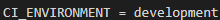

## Simple `LAPOR` :heavy_exclamation_mark:
Anda mengetahui aplikasi `lapor` yang dibuat oleh pemerintah republik indonesia? jika tidak silahkan kunjungi 
http://lapor.go.id, maka anda akan mendapatkan laman seperti gambar di bawah

Kali ini kita akan membuat aplikasi web seperti `lapor` untuk mengumpulkan laporan/komentar terkait layanan
di program studi teknik informatika ITERA.
**Luangkan waktu untuk membaca spesifikasi ini sampai selesai.** :kissing_heart:

### Anggota Tim :cyclone:
Project dikerjakan secara **berkelompok** dengan maksimal jumlah anggota adalah 2-3 orang mahasiswa.

### Petunjuk Pengerjaan :umbrella:
1. Fork pada repository ini dengan akun github anda.
2. Silakan commit pada repository anda (hasil fork). Lakukan berberapa commit dengan pesan yang bermakna,
contoh: fix css, membuat post done, jangan seperti final, benerin dikit, oke deh, update deh dll. 
Disarankan untuk tidak melakukan commit dengan perubahan yang besar karena akan mempengaruhi 
penilaian (contoh: hanya melakukan satu commit kemudian dikumpulkan).
3. Minimal commit sebanyak personil anggota tim dengan masing-masing personil tim melakukan commit sesuai dengan kesepakatan tim, penilaian individu akan dilihat.
4. Ubah **Penjelasan Teknis** pada bagian bawah readme.md ini dengan menjelaskan bagaimana cara anda:
   - Instalasi Framework, Koneksi basis data 
   - Melakukan validasi pada client-side
   - Melakukan AJAX (mulai dari pengguna melakukan klik pada tombol LAPOR! sampai laporan/komentar terkirim).
5. Pull request dari repository anda ke repository ini dengan 
format **NIM** - **Nama Lengkap**. **Waktu terkahir proses pull request adalah 4 hari setelah 
ujian akhir semester (UAS)**
6. Data yang dikumpulkan adalah:
   - Source code aplikasi
   - Basis data, dan
   - Cara instalasi aplikasi anda
7. Penilaian:
   - Kerjasama tim
   - Kesesuaian dengan spesifikasi
   - Pemahaman dalam penggunaan framework, penilaian efisiensi query
   - Antarmuka aplikasi
   - Bug free :beetle:
   
### Tools :hammer:
1. Untuk backend, wajib menggunakan PHP framework apapun (Contoh: Codeigniter, Laravel, Slim, Yii dll).
2. Gunakan MySQL atau basis data relasional lain untuk menyimpan data.
3. Untuk frontend, gunakan Javascript, HTML dan CSS. **Tidak boleh menggunakan library atau framework CSS atau JS seperti 
JQuery atau Bootstrap.** CSS sebisa mungkin ada di file yang berbeda (tidak inline styling/embeding styling).

### Spesifikasi Simple LAPOR!
#### Tampilan :soccer:
Anda diminta untuk membuat tampilan sedemikian hingga mirip dengan tampilan berikut. Website yang diminta tidak harus 
responsive. Desain tampilan tidak perlu dibuat indah. Icon dan jenis font tidak harus sama dengan contoh. Warna font, 
garis pemisah, dan perbedaan ukuran font harus terlihat sesuai contoh. Perhatikan juga tata letak elemen-elemen.

- Search bar diletakkan di bagian paling atas dibawah judul.
- Tombol "cari" berada di sebelah kanan search bar.
- **Buat LAPOR!** digunakan untuk mengirimkan laporan/komentar baru.
- Tampilan search bar ini harus tetap ada walaupun anda tidak mengimplementasikan fitur search.
- Tampilan pertanyaan tidak harus urut berdasarkan "Laporan/Komentar terakhir", 
namun tulisan "Laporan/komentar Terakhir" ini harus ada.

- Tampilan di atas digunakan untuk mengajukan atau mengubah laporan/komentar.
- Perhatikan label dari field pada form berada di dalam field (tidak di luar)
- Apek yang dilaporkan ditampilkan dalam bentuk `select`

- Bagian ini menampilkan laporan/komentar. Bagian `datetime` harus ada. Tanda `kuote` tidak harus ada
- Perhatikan label dari field pada form berada di dalam field (tidak di luar)

### List laporan/komentar
Halaman utama berisi daftar judul pertanyaan, siapa yang bertanya, dan isi pertanyaan. Isi pertanyaan yang terlalu 
panjang harus dipotong. Silakan definisikan sendiri seberapa panjang agar tetap baik terlihat di layout yang Anda buat.

Pada masing-masing elemen list, terdapat menu untuk mengubah dan menghapus pertanyaan.

View Laporan ditampilkan secara terurut dimulai dari laporan terakhir yang diberikan highlight

### Kirim laporan/komentar `LAPOR!`
Pengguna dapat mengajukan laporan/komentar. Form yang digunakan memiliki komentar (textarea), 
data lapiran berupa gambar 
dan file berekstention `doc, docx, xls, xlsx, ppt, pptx, pdf``. Gunakan HTTP POST.

### Ubah Laporan/komentar
Pengguna dapat mengubah laporan/komentar yang sudah dibuat. Form yang digunakan memiliki tampilan yang sama dengan 
form untuk bertanya, namun field-field yang ada sudah terisi. Gunakan HTTP POST untuk menyimpan perubahan.

### Hapus Laporan/komentar
Pengguna dapat menghapus laporan/komentar yang sudah dibuat. Lakukan konfirmasi penghapusan dengan `javascript`.

### Lihat Laporan/komentar
Pengguna dapat melihat laporan/komentar. Pada halaman ini terdapat informasi aspek yang dilaporkan.
(Dosen, Staff, Mahasiswa, Infrastruktur dan Pengajaran ), isi laporan/komentar, waktu pengiriman komentar `datetime` 
dan file lapiran. 

### Validasi
Validasi **wajib** dilakukan pada *client-side*, dengan menggunakan **javascript** bukan HTML 5 input type, yaitu:
- Setiap field pada form tidak boleh kosong.
- minimal jumlah kata dalam laporan/komentar adalah 20 kata.

### Bonus
Pengguna dapat mencari laporan/komentar dengan melakukan search ke `isi laporan/komentar`.

### Penjelasan Teknis
`Instalasi Framework dan Koneksi Database`
1. Instalasi Framework
Framework yang digunakan adalah Codeigniter 4. Sebelum menginstall CI4 sebaiknya install terlebih dahulu Composer, XAMPP, dan Git.
a. Menginstall XAMPP
- Download XAMPP sesuai dengan OS anda pada link berikut ini https://www.apachefriends.org/download.html
- Ikuti alur instalasi seperti pada umumnya.
b. Menginstall Composer
- Buka link berikut ini https://getcomposer.org/download/
- Bila anda menggunakan Windows, silakan download dan install file yang tersedia di dalam link tersebut
- Bila anda menggunakan Linux atau Mac OS, silakan copy paste code yang tersedia di dalam link teresebut ke terminal anda.
c. Menginstall Git
- Download Git sesuai dengan OS anda pada link berikut ini https://git-scm.com/downloads
- Ikuti alur instalasi seperti pada umumnya

Setelah menginstall ketiganya, buka folder htdocs di dalam folder XAMPP anda. Setelah itu masuk ke Git dengan melakukan klik kanan dan klik 'Git Bash Here'. Saat berada di dalam Git, mcopy dan paste code berikut ini dan ubah nama_folder sesuai keinginan anda.`composer create-project codeigniter4/appstarter nama_folder --no-dev`. Untuk menjalankan project yang telah berhasil kita buat, masuk terlebih dahulu ke dalam folder project yang baru saja kita buat. Lalu ketikkan `php spark serve`, untuk menghentikannya tekan Ctrl + C. Setelah itu, buka http://localhost:8080/ untuk melihat hasil pengerjaan project anda.

Agar dapat push hasil pengerjaan, maka fork repository utama terlebih dahulu. Setelah itu, hasil fork diclone di device masing-masing anggota kelompok dengan cara memasukkan `git clone https://github.com/andreitera/-IF3028-TUBESPEMWEB-2021.git`. Setelah itu copy dan paste seluruh file framework yang baru saja di buat ke dalam file hasil clone.

2. Koneksi Database
Setelah berhasil menginstall framework, lakukan hal-hal berikut ini agar dapat mengkoneksikan database.
a. Buka aplikasi XAMPP anda, pada bagian module Apache klik 'Config' dan pilih PHP (php.ini). Di dalam file tersebut, cari `;extension=intl` dan hapus tanda semicolonnya `'`.
b. Buat database yang akan dipakai  di dalam project ini, dengan cara start Apache dan MySQL di XAMPP. Lalu, masuk ke dalam Shell pada XAMPP atau buka http://localhost/phpmyadmin/ pada browser kesayangan anda. Setelah itu buatlah database yang akan dipakai.
c. Buka folder project dan cari file `env`, setelah itu ubah atau duplicate menjadi `.env`.
d. Buka file `.env`, dan cari . Setelah itu hapus tanda `#` dan ubah database sesuai dengan database yang digunakan serta ubah pula passwordnya. Cari pula , dan hapus tanda `#` serta ubah valuenya menjadi `development`.

`Melakukan validasi pada client-side.`
Saat user menekan tombol tambah atau edit laporan, form akan dikirimkan ke dalam file `validation.js`, tepatnya ke dalam fungsi validasi. File tersebut berada di dalam path public/assets/js/.

Di dalam file tersebut akan dibaca value dari konten, aspek, dan nama file yang telah dimasukkan oleh user. Proses validasi terurut sebagai berikut:
1. Akan dilakukan pemecahan value konten terlebih dahulu dan hasilnya dimasukkan ke dalam sebuah array, setelah itu array tersebut akan dicek apakah indexnya kurang dari 20. Bila kurang dari 20 maka akan tampil alert "Laporan setidaknya terdiri dari 20 kata!", dan  user akan diminta untuk mengisi form kembali tanpa merestart form yang sebelumnya. Bila tidak, maka akan dilakukan pengecekan kedua.
2. Pada project yang kami buat, value default dari aspek adalah 0. Bila saat dilakukan pengecekan diketahui bahwa value aspek adalah 0, maka akan tampil alert "Pilih aspek terlebih dahulu!", dan user akan diminta untuk mengisi form kembali tanpa merestart form yang sebelumnya. Bila tdak, maka akan dilakukan pengecekan ketiga.
3. Pada pengecekan ketiga, akan dilakukan pengecekan nama file. Bila nama filenya kosong, maka akan muncul alert "Masukkan lampiran terlebih dahulu",  dan user akan diminta untuk mengisi form kembali tanpa merestart form yang sebelumnya. Bila tdak, maka akan dilakukan pengecekan ketiga. Bila tidak, maka akan dilakukan pengecekan keempat.
4. Pada pengecekan ini, sudah tersedia array yang berisi ekstensi-ekstensi yang diperkenankan untuk diupload. Setelah itu nama file akan dipecah dan index terakhir akan disimpan sebagai ekstensi. Lalu ekstensi file akan dicocokkan dengan array yang berisi ekstensi-ekstensi yang diperkenankan. Bila tidak terdapat ekstensi yang sama, maka hasilnya akan false, lalu akan ditampilkan alert "Ekstensi file tidak didukung!", dan user akan diminta untuk mengisi form kembali tanpa merestart form yang sebelumnya. Bila terdapat ekstensi yang tepat, maka validasi berhasil dilewati dan akan diteruskan ke dalam proses save data.

`Melakukan AJAX (mulai dari pengguna melakukan klik pada tombol LAPOR! sampai laporan/komentar terkirim).`
Saat user menekan tombol lapor, maka akan dialihkan ke dalam form create. Di dalam form create, akan diminta mengisi 3 data, yaitu isi laporan, aspek, dan lampiran. Setelah itu, saat user menekan tombol buat laporan, akan dijalankan validasi yang dilakukan dengan javascript. Bila tidak lolos validasi, maka akan muncul alert dan diminta untuk mengisi form kembali. Bila lolos validasi maka data akan dikirimkan ke dalam controller Home.php pada method save. 

Pada method save, akan diambil data-data yang telah diisi di dalam form. Bila dari data tersebut tidak terdapat id, maka data-data tersebut akan disimpan dengan menggunakan fungsi save bawaan CI4. Created_at dan id dari data-data tersebut akan otomatis dibuat oleh DB dan CI4.

### Knowledge
Untuk meringankan beban tugas ini, ada berberapa keyword yang bisa anda cari untuk menyelesaikan tugas ini.
- CSS: margin, padding, header tag, font-size, text-align, float, clear, border, color, div, span, placeholder, 
anchor tag.
- Javascript : XMLHTTPRequest.
- PHP Framework : [Codeigniter](https://codeigniter.com/en/docs), [Laravel](https://laravel.com/docs/6.x) dll.
- SQL query: SELECT, INSERT, UPDATE, DELETE, WHERE, operator LIKE.

:telephone: Jika ada pertanyaan silakan tanyakan lewat `Asisten`.

### About :honeybee:

Dosen       : Dicky Prima Satya, M.T., Andre Febrianto, S.Kom., M.Eng., Amirul Iqbal, S.Kom., M.Eng.

