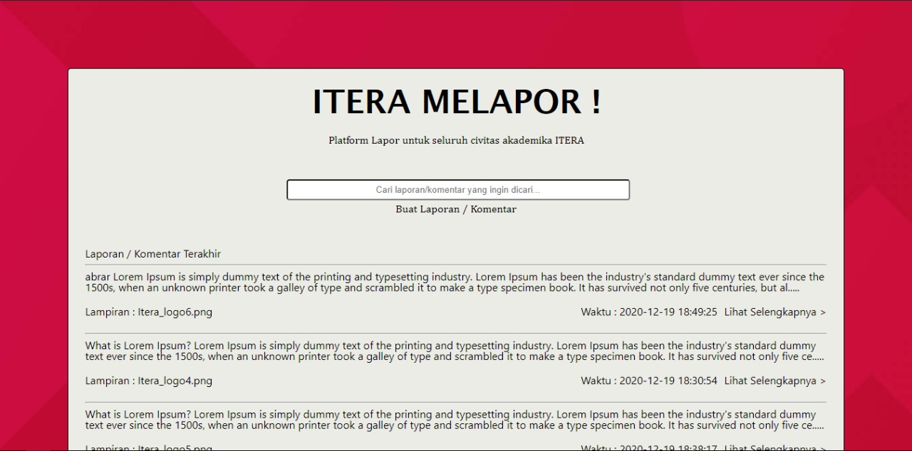
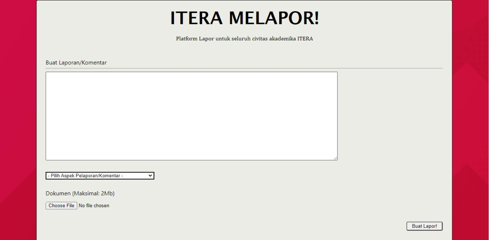
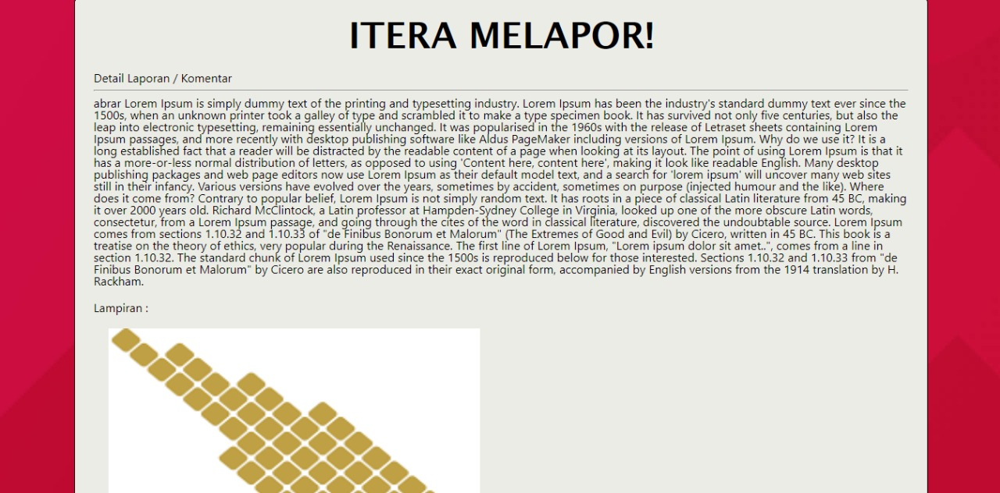

### Spesifikasi Simple LAPOR!
#### Tampilan :soccer:
Anda diminta untuk membuat tampilan sedemikian hingga mirip dengan tampilan berikut. Website yang diminta tidak harus 
responsive. Desain tampilan tidak perlu dibuat indah. Icon dan jenis font tidak harus sama dengan contoh. Warna font, 
garis pemisah, dan perbedaan ukuran font harus terlihat sesuai contoh. Perhatikan juga tata letak elemen-elemen.

### List laporan/komentar
Halaman utama berisi daftar judul pertanyaan, siapa yang bertanya, dan isi pertanyaan. Isi pertanyaan yang terlalu 
panjang harus dipotong. Silakan definisikan sendiri seberapa panjang agar tetap baik terlihat di layout yang Anda buat.

Pada masing-masing elemen list, terdapat menu untuk mengubah dan menghapus pertanyaan.

View Laporan ditampilkan secara terurut dimulai dari laporan terakhir yang diberikan highlight

### Kirim laporan/komentar `LAPOR!`
Pengguna dapat mengajukan laporan/komentar. Form yang digunakan memiliki komentar (textarea), 
data lapiran berupa gambar 
dan file berekstention `doc, docx, xls, xlsx, ppt, pptx, pdf``. Gunakan HTTP POST.

### Ubah Laporan/komentar
Pengguna dapat mengubah laporan/komentar yang sudah dibuat. Form yang digunakan memiliki tampilan yang sama dengan 
form untuk bertanya, namun field-field yang ada sudah terisi. Gunakan HTTP POST untuk menyimpan perubahan.

### Hapus Laporan/komentar
Pengguna dapat menghapus laporan/komentar yang sudah dibuat. Lakukan konfirmasi penghapusan dengan `javascript`.

### Lihat Laporan/komentar
Pengguna dapat melihat laporan/komentar. Pada halaman ini terdapat informasi aspek yang dilaporkan.
(Dosen, Staff, Mahasiswa, Infrastruktur dan Pengajaran ), isi laporan/komentar, waktu pengiriman komentar `datetime` 
dan file lapiran. 

### Validasi
Validasi **wajib** dilakukan pada *client-side*, dengan menggunakan **javascript** bukan HTML 5 input type, yaitu:
- Setiap field pada form tidak boleh kosong.
- minimal jumlah kata dalam laporan/komentar adalah 20 kata.

### Bonus
Pengguna dapat mencari laporan/komentar dengan melakukan search ke `isi laporan/komentar`.

### Penjelasan Teknis
'Instalasi Framework Code Igniteter 3 dan database'
~ Mendownload file code igniter 3 melalui https://codeigniter.com/download
~ Melakukan ekstraksi file ke dalam file htdocs di xampp
~ framework Code Igniter siap untuk di konfigurasi
~ Untuk mengkoneksikan database, terlebih dahulu membuat database pada my sql
~ Setelah database dibuat, proses koneksi database dapat dikonfigurasi pada path file config/database.php 
~ ubah pada variabel database dengan mengisikan database yang dimaksud
~ framework dan database siap digunakan

'Validasi Client-Side'
~ Validasi client-side digunakan untuk memvalidasi mengenai data yang user inputkan
~ Apabila terdapat ketidaksesuaian data yang diinputkan oleh pengguna maka akan ada pemberitahuan mengenai kesalahan
~ Konfigurasi terhadap client-side terdapat pada application/models/Lapor_Model
~ Didalam folder tersebut didefinisikan bahwa minimal inputan komentar/keterangan 100 karakter,
~ file yang dapat diinputkan berupa (doc, docx, xls, xlsx, ppt, pptx, pdf)
~ Komentar/keterang wajib diisi apabila ingin melanjutkan proses

'Melakukan AJAX'
~ dalam konfigurasi ajax, terutama pada fitur LAPOR, aplikasi akan melakukan proses tambah tampah harus mereload
~ konfigurasi ajax dapat dilihat pada path file asset/ajax

''
### Knowledge
Untuk meringankan beban tugas ini, ada berberapa keyword yang bisa anda cari untuk menyelesaikan tugas ini.
- CSS: margin, padding, header tag, font-size, text-align, float, clear, border, color, div, span, placeholder, 
anchor tag.
- Javascript : XMLHTTPRequest.
- PHP Framework : [Codeigniter](https://codeigniter.com/en/docs), [Laravel](https://laravel.com/docs/6.x) dll.
- SQL query: SELECT, INSERT, UPDATE, DELETE, WHERE, operator LIKE.

:telephone: Jika ada pertanyaan silakan tanyakan lewat `Asisten`.

### About :honeybee:

Dosen       : Dicky Prima Satya, M.T., Andre Febrianto, S.Kom., M.Eng., Amirul Iqbal, S.Kom., M.Eng.

