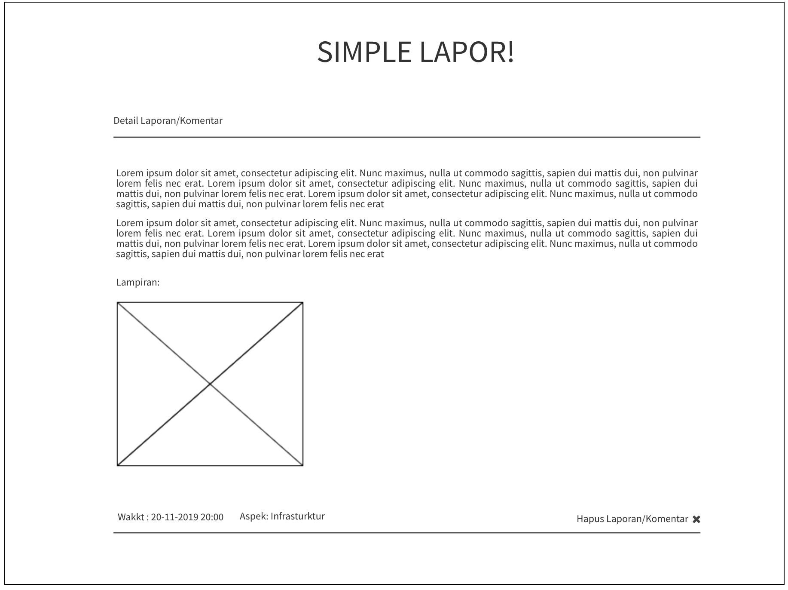

## Simple `LAPOR` :heavy_exclamation_mark:
Anda mengetahui aplikasi `lapor` yang dibuat oleh pemerintah republik indonesia? jika tidak silahkan kunjungi 
http://lapor.go.id, maka anda akan mendapatkan laman seperti gambar di bawah


Kali ini kita akan membuat aplikasi web seperti `lapor` untuk mengumpulkan laporan/komentar terkait layanan
di program studi teknik informatika ITERA.
**Luangkan waktu untuk membaca spesifikasi ini sampai selesai.** :kissing_heart:

### Anggota Tim :cyclone:
Project dikerjakan secara **berkelompok** dengan maksimal jumlah anggota adalah 2-3 orang mahasiswa.
1. Muhammad Najie K. (118140131)
2. Muhammad Khoirurrizqi (118140134)
3. Khoirul Roziq (118140142)

### Petunjuk Pengerjaan :umbrella:
1. Fork pada repository ini dengan akun github anda.
2. Silakan commit pada repository anda (hasil fork). Lakukan berberapa commit dengan pesan yang bermakna,
contoh: fix css, membuat post done, jangan seperti final, benerin dikit, oke deh, update deh dll. 
Disarankan untuk tidak melakukan commit dengan perubahan yang besar karena akan mempengaruhi 
penilaian (contoh: hanya melakukan satu commit kemudian dikumpulkan).
3. Minimal commit sebanyak personil anggota tim dengan masing-masing personil tim melakukan commit sesuai dengan kesepakatan tim, penilaian individu akan dilihat.
4. Ubah **Penjelasan Teknis** pada bagian bawah readme.md ini dengan menjelaskan bagaimana cara anda:
   - Instalasi Framework, Koneksi basis data 
   - Melakukan validasi pada client-side
   - Melakukan AJAX (mulai dari pengguna melakukan klik pada tombol LAPOR! sampai laporan/komentar terkirim).
5. Pull request dari repository anda ke repository ini dengan 
format **NIM** - **Nama Lengkap**. **Waktu terkahir proses pull request adalah 4 hari setelah 
ujian akhir semester (UAS)**
6. Data yang dikumpulkan adalah:
   - Source code aplikasi
   - Basis data, dan
   - Cara instalasi aplikasi anda
7. Penilaian:
   - Kerjasama tim
   - Kesesuaian dengan spesifikasi
   - Pemahaman dalam penggunaan framework, penilaian efisiensi query
   - Antarmuka aplikasi
   - Bug free :beetle:
   
### Tools :hammer:
1. Untuk backend, wajib menggunakan PHP framework apapun (Contoh: Codeigniter, Laravel, Slim, Yii dll).
2. Gunakan MySQL atau basis data relasional lain untuk menyimpan data.
3. Untuk frontend, gunakan Javascript, HTML dan CSS. **Tidak boleh menggunakan library atau framework CSS atau JS seperti 
JQuery atau Bootstrap.** CSS sebisa mungkin ada di file yang berbeda (tidak inline styling/embeding styling).

### Spesifikasi Simple LAPOR!
#### Tampilan :soccer:
Anda diminta untuk membuat tampilan sedemikian hingga mirip dengan tampilan berikut. Website yang diminta tidak harus 
responsive. Desain tampilan tidak perlu dibuat indah. Icon dan jenis font tidak harus sama dengan contoh. Warna font, 
garis pemisah, dan perbedaan ukuran font harus terlihat sesuai contoh. Perhatikan juga tata letak elemen-elemen.


- Search bar diletakkan di bagian paling atas dibawah judul.
- Tombol "cari" berada di sebelah kanan search bar.
- **Buat LAPOR!** digunakan untuk mengirimkan laporan/komentar baru.
- Tampilan search bar ini harus tetap ada walaupun anda tidak mengimplementasikan fitur search.
- Tampilan pertanyaan tidak harus urut berdasarkan "Laporan/Komentar terakhir", 
namun tulisan "Laporan/komentar Terakhir" ini harus ada.


- Tampilan di atas digunakan untuk mengajukan atau mengubah laporan/komentar.
- Perhatikan label dari field pada form berada di dalam field (tidak di luar)
- Apek yang dilaporkan ditampilkan dalam bentuk `select`


- Bagian ini menampilkan laporan/komentar. Bagian `datetime` harus ada. Tanda `kuote` tidak harus ada
- Perhatikan label dari field pada form berada di dalam field (tidak di luar)

### List laporan/komentar
Halaman utama berisi daftar judul pertanyaan, siapa yang bertanya, dan isi pertanyaan. Isi pertanyaan yang terlalu 
panjang harus dipotong. Silakan definisikan sendiri seberapa panjang agar tetap baik terlihat di layout yang Anda buat.

Pada masing-masing elemen list, terdapat menu untuk mengubah dan menghapus pertanyaan.

View Laporan ditampilkan secara terurut dimulai dari laporan terakhir yang diberikan highlight

### Kirim laporan/komentar `LAPOR!`
Pengguna dapat mengajukan laporan/komentar. Form yang digunakan memiliki komentar (textarea), 
data lapiran berupa gambar 
dan file berekstention `doc, docx, xls, xlsx, ppt, pptx, pdf``. Gunakan HTTP POST.

### Ubah Laporan/komentar
Pengguna dapat mengubah laporan/komentar yang sudah dibuat. Form yang digunakan memiliki tampilan yang sama dengan 
form untuk bertanya, namun field-field yang ada sudah terisi. Gunakan HTTP POST untuk menyimpan perubahan.

### Hapus Laporan/komentar
Pengguna dapat menghapus laporan/komentar yang sudah dibuat. Lakukan konfirmasi penghapusan dengan `javascript`.

### Lihat Laporan/komentar
Pengguna dapat melihat laporan/komentar. Pada halaman ini terdapat informasi aspek yang dilaporkan.
(Dosen, Staff, Mahasiswa, Infrastruktur dan Pengajaran ), isi laporan/komentar, waktu pengiriman komentar `datetime` 
dan file lapiran. 

### Validasi
Validasi **wajib** dilakukan pada *client-side*, dengan menggunakan **javascript** bukan HTML 5 input type, yaitu:
- Setiap field pada form tidak boleh kosong.
- minimal jumlah kata dalam laporan/komentar adalah 20 kata.

### Bonus
Pengguna dapat mencari laporan/komentar dengan melakukan search ke `isi laporan/komentar`.

### Penjelasan Teknis
#### `Instalasi Framework dan Koneksi Database`
##### 1. Instalasi Framework
Mohon untuk melakukan instalasi tools berikut untuk menjalankan proyek CI4 ini. 
Requirement:
1. [Composer](https://getcomposer.org/download/)
2. [XAMPP](https://www.apachefriends.org/download.html)
3. [Git](https://git-scm.com/downloads)

Setelah melakukan instalasi requirement tersebut. Lakukan **```clone```** terhadap repository ini menggunakan **Git** dan simpan pada direktori penyimpanan Anda.

Download seluruh package atau library tambahan yang digunakan CodeIgniter dengan langkah-langkah berikut.
1. Buka ```command prompt```
2. Arahkan ke project root tempat Anda menyimpan proyek yang telah di-clone sebelumnya.
3. Ketik perintah ```composer update``` lalu enter
4. Tunggu sampai proses *download* selesai

Aktifkan extension intl pada PHP dengan cara berikut.
1. Buka XAMPP.
2. Pada bagian module Apache, klik button ```Config``` dan pilih ```PHP (php.ini)```
3. Cari ```;extension=intl``` dan hapus komentar dengan cara hapus tanda semicolon di depannya menjadi `extension=intl`
4. Setelah selesai, simpan konfigurasi tersebut.
Note: Apabila tidak dapat menyimpan perubahan maka pastikan anda membukanya dalam keadaan mode Administrator PC.

##### 2. Koneksi Database
1. Buka akses ke DBMS MySQLi, dapat menggunakan CLI atau pun lewat http://localhost/phpmyadmin menggunakan browser kesayangan Anda.
2. Lakukan import [Database dan Table](db_lapor.sql) yang telah disediakan pada repository ini.
3. Atur ulang pengaturan untuk akses ke MySQLi sesuai dengan pengaturan Anda pada file environment `.env` di project root. Pengaturannya dapat dilihat seperti gambar berikut.

Hapus tanda `#` pada setiap barisnya untuk mengaktifkan dan ubah database sesuai dengan database telah disediakan (`lapor`).
4. Simpan pengaturan file.

##### 3. Menjalankan Web App
1. Buka kembali `command prompt`
2. Arahkan pada project root.
3. Jalankan perintah `php spark serve`
4. Buka Browser kesayangan Anda.
5. Ketik pada kotak URI, `localhost:8080` dan enter.
6. Pada titik ini seharusnya aplikasi sudah dapat digunakan.
**Note: Pastikan port ```127.0.0.1:8080``` sedang tidak digunakan oleh Aplikasi lain.**

#### `Melakukan validasi pada client-side.`
Saat user menekan tombol tambah atau edit laporan, form akan dikirimkan ke dalam file `validation.js`, tepatnya ke dalam fungsi validasi. File tersebut berada di dalam path public/assets/js/.

Di dalam file tersebut akan dibaca value dari konten, aspek, dan nama file yang telah dimasukkan oleh user. Proses validasi terurut sebagai berikut:
1. Akan dilakukan pemecahan value konten terlebih dahulu dan hasilnya dimasukkan ke dalam sebuah array, setelah itu array tersebut akan dicek apakah indexnya kurang dari 20. Bila kurang dari 20 maka akan tampil alert "Laporan setidaknya terdiri dari 20 kata!", dan  user akan diminta untuk mengisi form kembali tanpa merestart form yang sebelumnya. Bila tidak, maka akan dilakukan pengecekan kedua.
2. Pada project yang kami buat, value default dari aspek adalah 0. Bila saat dilakukan pengecekan diketahui bahwa value aspek adalah 0, maka akan tampil alert "Pilih aspek terlebih dahulu!", dan user akan diminta untuk mengisi form kembali tanpa merestart form yang sebelumnya. Bila tdak, maka akan dilakukan pengecekan ketiga.
3. Pada pengecekan ketiga, akan dilakukan pengecekan nama file. Bila nama filenya kosong, maka akan muncul alert "Masukkan lampiran terlebih dahulu",  dan user akan diminta untuk mengisi form kembali tanpa merestart form yang sebelumnya. Bila tdak, maka akan dilakukan pengecekan ketiga. Bila tidak, maka akan dilakukan pengecekan keempat.
4. Pada pengecekan ini, sudah tersedia array yang berisi ekstensi-ekstensi yang diperkenankan untuk diupload. Setelah itu nama file akan dipecah dan index terakhir akan disimpan sebagai ekstensi. Lalu ekstensi file akan dicocokkan dengan array yang berisi ekstensi-ekstensi yang diperkenankan. Bila tidak terdapat ekstensi yang sama, maka hasilnya akan false, lalu akan ditampilkan alert "Ekstensi file tidak didukung!", dan user akan diminta untuk mengisi form kembali tanpa merestart form yang sebelumnya. Bila terdapat ekstensi yang tepat, maka validasi berhasil dilewati dan akan diteruskan ke dalam proses save data.

#### `Melakukan AJAX`
Pada fitur pencarian.
1. Ketik apapun pada kolom pencarian.
2. Klik button `cari`.
3. Otomatis penampilan hasil pencarian dengan AJAX.

Cara kerjanya:
1. Ada fungsi trigger pemanggilan fungsi `fetchLaporan()` apabila button cari diklik.
2. Fungsi akan membuat objek XMLHttpRequest.
3. XMLHttpRequest akan melakukan request ke halaman `home/search` dengan Query String berupa nilai dari pencarian (XHR akan memastikan jalannya request secara Asynchronous).
4. Method search akan jalan sesuai pengaturan routes.
5. Keyword dari Query String akan disimpan dan dilakukan permintaan data dari model sesuai dengan keyword.
6. Data disimpan dalam bentuk array dan data tersebut dioper ke dalam view `search_result`
7. Method search akan mengembalikan view tersebut.
8. XHR akan menimpa list laporan yang ditampilkan dengan data baru sesuai dengan kembalian view ketika XHR sudah mendeteksi adanya kembalian yang berhasil dilakukan.
9. List Laporan akan tampil sesuai dengan keyword. Apabila tidak terdapat data yang sesuai dengan keyword maka akan ditampilkan bahwa tidak terdapat data yang sesuai.

### Knowledge
Untuk meringankan beban tugas ini, ada berberapa keyword yang bisa anda cari untuk menyelesaikan tugas ini.
- CSS: margin, padding, header tag, font-size, text-align, float, clear, border, color, div, span, placeholder, 
anchor tag.
- Javascript : XMLHTTPRequest.
- PHP Framework : [Codeigniter](https://codeigniter.com/en/docs), [Laravel](https://laravel.com/docs/6.x) dll.
- SQL query: SELECT, INSERT, UPDATE, DELETE, WHERE, operator LIKE.

:telephone: Jika ada pertanyaan silakan tanyakan lewat `Asisten`.

### About :honeybee:

Dosen       : Dicky Prima Satya, M.T., Andre Febrianto, S.Kom., M.Eng., Amirul Iqbal, S.Kom., M.Eng.

